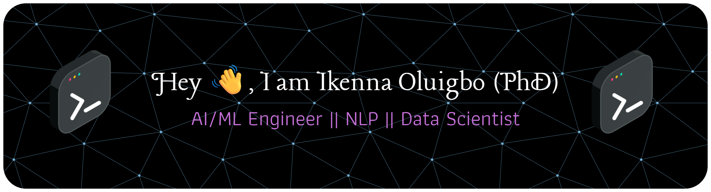
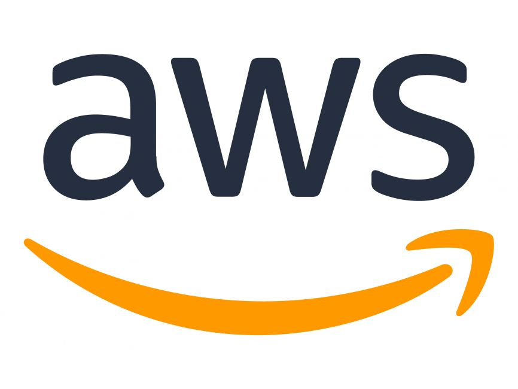
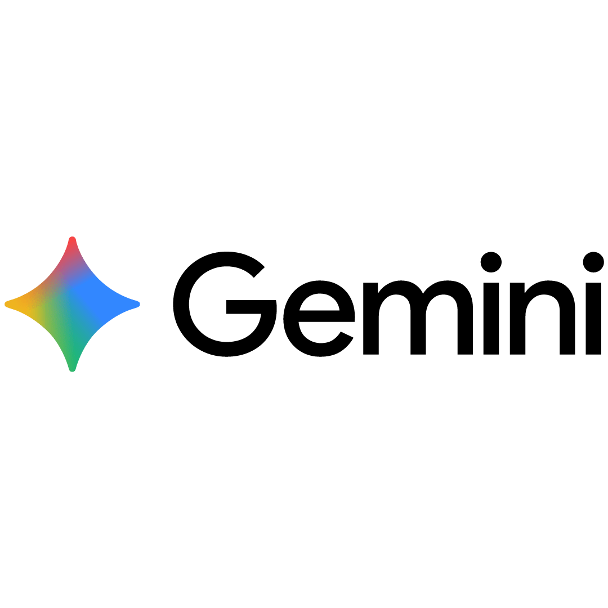
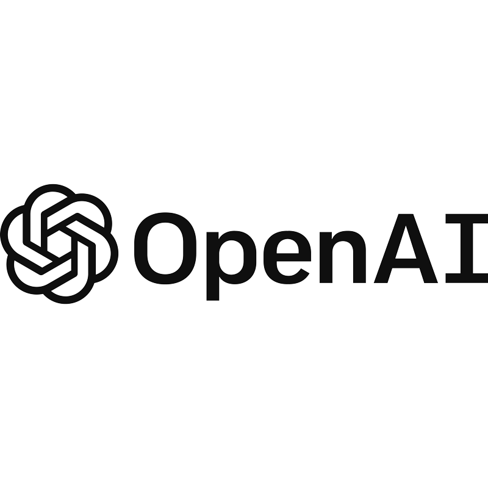
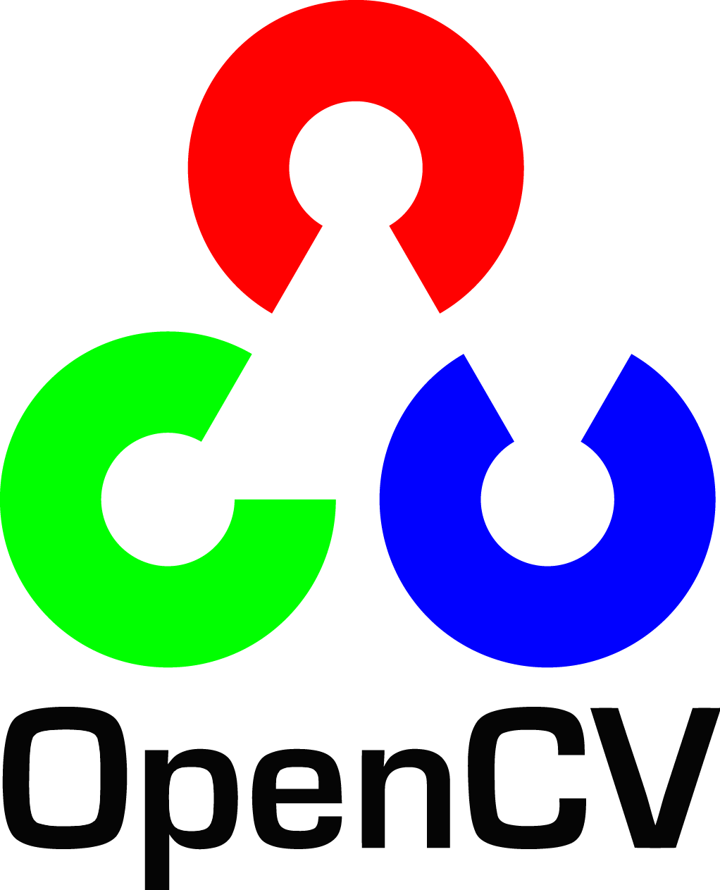
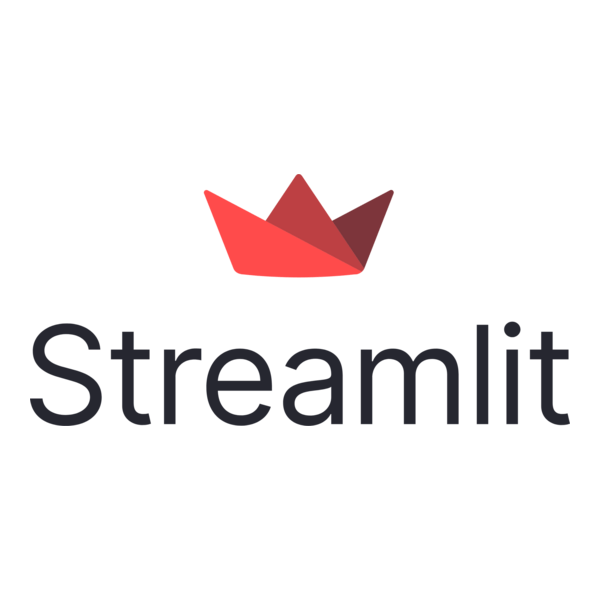

<!--
**ikenna-oluigbo/ikenna-oluigbo** is a ✨ _special_ ✨ repository because its `README.md` (this file) appears on your GitHub profile.

#Here are some ideas to get you started:  -->

- 🔭 I’m currently working on **AI Agents and RAG Integrated LLMs**
- 🌱 I’m currently learning **Multi-agent delegation and AI Governance**
- 👯 I’m looking to collaborate on **AI agents and LLM projects**
- 💬 Ask me about **Machine Learning, AI, Computer Vision, NLP, Data Science, and Knowledge Graphs**
- 📫 How to reach me: **ikenna.oluigbo@gmail.com**
- 😄 Pronouns: **Only my name is Fine**
- ⚡ Fun fact: **Convert anything to numbers, and find patterns in the numbers**

## Language and Tools 

